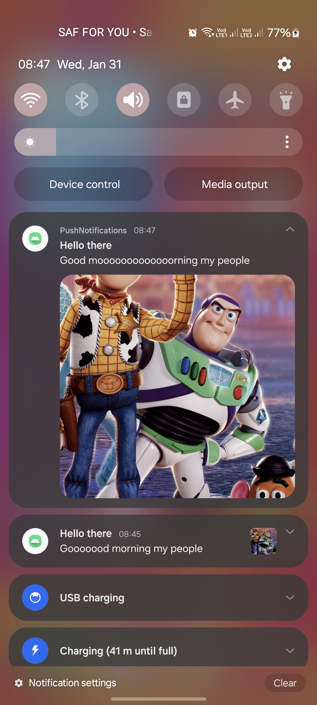
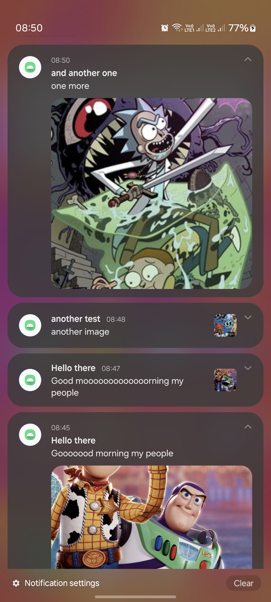

a markdown describing the functionalities of this app

# An android app that allows you to send push notification to your android device
# using firebase cloud messaging

# How to use
1. Clone this repo
2. Create a firebase project
3. Add an android app to the project
4. Download the google-services.json file and add it to the app folder
5. Build and run the app
6. Copy the token from the app and paste it in the firebase console
7. Send a notification from the firebase console
8. You should receive the notification on your device
9. You can also send a notification from the app
10. You can also send a notification from the app to a specific topic
11. You can also send a notification from the app to a specific user
12. You can also send a notification from the app to a specific device

# Screenshots

    

        <h3>Notification</h3>
        
    

    

        <h3>Notification</h3>
        
    

    

        <h3>Notification</h3>
        
    

